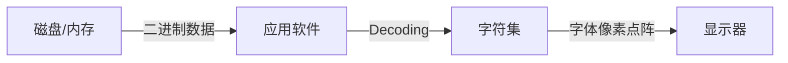
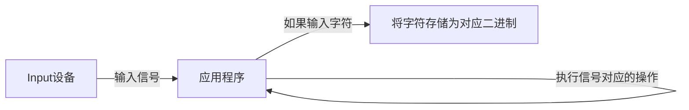
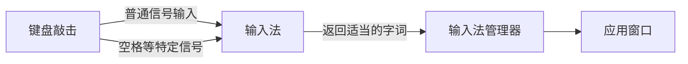
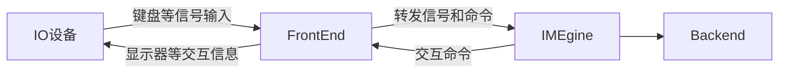

> 字符编码是个很冷门的话题，但字符编码在某种程度上，的确让Computer实现了从直译计算机到俗称电脑的一个小跨越。（不再局限于数值计算）
>
> 当然，计算机从来没有理解过自然语言，但字符编码，却使得我们能借助计算机完成一系列自然语言文字的处理。

字符编码（英语：Character encoding）也称字集码，是把字符集中的字符编码为指定集合中某一对象（例如：比特模式、自然数序列、8位组或者电脉冲），以便文本在计算机中存储和通过通信网络的传递。常见的例子包括将拉丁字母表编码成摩斯电码和ASCII。其中，ASCII将字母、数字和其它符号编号，并用7比特的二进制来表示这个整数。通常会额外使用一个扩充的比特，以便于以1个字节的方式存储。

**文字从内存到显示器的过程**



**文字输入的过程**




# ASCII和ANSI

在最早期的机器时代，都是纸带打孔，都叫Computer了，做的事情自然是Compute为主，并没有字符编码的需求。

## ASCII

ASCII第一次以规范标准的类型发表是在1967年，最后一次更新则是在1986年，到目前为止共定义了128个字符.

> IBM360是在1964年发布问世。
>
> 8086系列是在1978年首次发布。

## ANSI

在ASCII的基础上，各个国家和地区为了适配、编码本国字符，设计了各种标准的字符编码。

欧洲先后设计了EASCII和ISO/IEC 8859系列字符编码方案；中国设计了GB（国标）系列编码用于显示中文及相关字符（繁体有Big5编码）。日文（JIS）、韩文以及其他世界各个国家和地区的文字都有它们各自的编码。

这些各式的编码标准被微软统称为ANSI（American National Standards Institute）。

> ANSI这个组织做了很多标准制定工作，包括C语言规范ANSI C，还有与各国和地区既兼容ASCII又互相不兼容的字符编码相对应的“代码页(Code Page)”标准。
>
> ANSI规定简体中文的GB编码的代码页是936，所以GB编码又叫做ANSI Code Page 936。
>
> Windows中文操作系统默认的编码方式为ANSI 936。（在Region中可查看操作系统配置的国家和地区）
>
> 
>
> 用chcp（盲猜是character code page的缩写）命令查看使用的编码集。
>
> 
>
> UTF8的代码页是65001。

但ANSI的缺陷还是很明显的，比如，

* 仅知道ANSI编码还不够，还得知道国家地区才能解码
* 不同语言之间不兼容（ASCII部分除外），即同一份文本无法同时存储除英语外的两种语言。

> 在实际实践中，GBK好像也还是能兼容一丢丢其他语言的。害，咱也不懂第三外语，也没法评判兼容效果。

## 巨硬为啥要用ANSI

> 一般来说Windows函数都有两个版本，比如最常见的MessageBox有MessageBoxW和MessageBoxA.
>
> 在Windows Visa版本中，应用程序最后执行的都是UNICODE版本的函数，如果你调用的是ANSI的，那么ANSI版本的函数只是作为一个转换层（分配内存，转换为UNICODE），然后执行UNICODE版本的函数。使用ANSI甚至会有更多的开销。

个人还是有点疑问的，既然函数都是用UNICODE的了，为啥操作系统还要用ANSI呢，最后搞得很复杂。

# Unicode

一种国际统一的编码方式。The Unicode Consortium has devised the most comprehensive and widely accepted standard for encoding text.

Unicode现普遍采用UCS-2，即两个字节，基本够用。UCS-4规范包含几乎所有的汉字。

| 编码范围 | 对应内容 |
| ---- | ---- |
|0000-007F|C0控制符及基本拉丁文 (C0 Control and Basic Latin)|
|0080-00FF|C1控制符及拉丁文补充-1 (C1 Control and Latin 1 Supplement)|
|0100-017F|其他扩展和补充|
|0370-03FF|各种稀奇古怪的文字，希腊，阿拉伯，亚美尼亚，希伯来、马尔代夫、叙利亚等等等等|
|0E00-1D7F|还是各种文字，泰文、藏文、朝鲜、老挝、蒙古、加拿大土著等|
|1D80-20CF|语音学、货币符号，还有各种扩充|
|20D0-2BFF|组合、数字形式、几何图形、箭头等印刷或数学符号。|
|2C00-2E7F|其他杂七杂八|
|2E80-2EFF|CJK 部首补充 (CJK Radicals Supplement)|
|2F00-2FDF|康熙字典部首 (Kangxi Radicals)|
|2FF0-2FFF|表意文字描述符 (Ideographic Description Characters)|
|3000-303F|CJK 符号和标点 (CJK Symbols and Punctuation)|
|3040-309F|日文平假名 (Hiragana)|
|30A0-30FF|日文片假名 (Katakana)|
|3100-312F|注音字母 (Bopomofo)|
|3130-318F|朝鲜文兼容字母 (Hangul Compatibility Jamo)|
|3190-319F|象形字注释标志 (Kanbun)|
|31A0-31BF|注音字母扩展 (Bopomofo Extended)|
|31C0-31EF|CJK 笔画 (CJK Strokes)|
|31F0-31FF|日文片假名语音扩展 (Katakana Phonetic Extensions)|
|3200-32FF|封闭式 CJK 文字和月份 (Enclosed CJK Letters and Months)|
|3300-33FF|CJK 兼容 (CJK Compatibility)|
|3400-4DBF|CJK 统一表意符号扩展 A (CJK Unified Ideographs Extension A)|
|4DC0-4DFF|易经六十四卦符号 (Yijing Hexagrams Symbols)|
|4E00-9FBF|CJK 统一表意符号 (CJK Unified Ideographs)|
|A000-A4CF|彝文字根 (Yi Radicals)|
|A500-FE2F|杂七杂八一堆破事|
|FE30-FE4F|CJK 兼容形式 (CJK Compatibility Forms)|
|FE50-FFEF|一堆破事|
|FFF0-FFFF|特殊 (Specials)|

## UTF8

对Unicode编码的一种变长存储实现。

现在win10的记事本新建一个txt文档后默认的编码方式是utf8（至少我的是）。


> 例如“严”字的Unicode码是4E25，其UTF-8编码是E4B8A5，占三个字节。
>
> Unicode（0100 1110 0010 0101）-> UTF8（1110 0100 1011 1000 1010 0101）
>
> 其中UTF8编码中第一个字节的前半部分的E(1110)表示接下来的这个字符编码占3个字节，第二个字节（1011 1000）和第三个字节（1010 0101）都需要以“10”开头。

## 啥奇怪的东西都能混进Unicode

*  文字反向，
  * 字符实体编号&#8238
  * U+202E
* 菊花文
  * 字符实体编号：&#1161
  * U+0489


> The Unicode Technical Committee rejected a proposal to include a standard writing for Klingon.


# 细究计算机和编码

## 转换编码方式

表面看起来编码方式之间互相转换是理所当然的，但仔细一想，好像还真没那么直白。

通常Encoding理解为从内存（meomory）编码到（disk）的过程，而decoding则是反向的过程。可是——在disk上是二进制，加载到内存中不还是二进制了吗？怎么就encoding/decoding了呢？

```python
some_string = "The best day of my life."
```

当我们输入这行代码的时候，内存中存储的是二进制没错吧？

### char和string

```python
somebytes = '一句中文'.encode('utf8')
somebytes.decode('utf8').encode('gbk')
```

第二行代码可以将原来`utf8`编码的文字转换为`gbk`，看起来挺顺理成章的。

* 但是是在哪一步，计算机内存储的二进制，从字符对应的`utf8`二进制数据变成了`gbk`二进制数据呢？
* 如果某个`utf8`字符在`gbk`中不存在又该怎么办呢？
* 而`一句中文`这个string本身，又是如何存储在内存中的呢？总要编码成二进制的吧？那是utf8还是gbk呢？


在C中，可以有如下操作

```c
#include<stdio.h>
int main(){
    char a = 'a';
    int b = a;
    return 0;
}
```

如此一来，会将字符`a`对应的ASCII码赋值给`int`变量` b`。如无意外，`b=97`

但Python中全是引用（可能这么说略草率），也不需要预先指定数据类型。一般觉得`int()`这种方法用于不同类型的转换，而实际上它是用于将字符串中的数字转换为真正的数字。

通过`ord()`方法可以获得字符的Unicode编码。

## 编辑器

当用一个编辑器（记事本、Vim或者Typora）打开一个文本文件时，要做的第一件事就是确定这个文本文件使用哪种编码方式保存。

### 检测文件头标识

BOM，Byte Order Mark，字节顺序标记。位于文件的最开始。

当打开一个文本文件时，就BOM而言，有如下几种情形。

* EF BB BF标识编码方式UTF8
* FF FE标识编码方式UTF-16LE
* FF FE 00 00标识编码方式


### 提示用户手动选择

### 根据一定的规则自行推断

> 记事本和“联通”。
>
> 用ANSI编码保存联通两个字后，由于没有BOM，记事本没有提供用户显式选择的功能


### UltraEdit

UltraEdit提供的功能有助于加深对编辑器定位的理解。

编辑器内的内容是直接保存在内存中或磁盘上的，因此，显然编辑器记住（写到磁盘）或者得到（从磁盘读）的都是二进制（即编码后的内容）。

但编辑器在GUI界面显示的却是解码后（或者说编码前）的内容。

因此，解码和编码（Encoding和Decoding）的工作，正是由编辑器完成的呀。


## 谁动了我的二进制数据

1. 在VS Code（其他编辑器也一样，没差）中从一份GB 2312编码的文件中复制一串中文。
2. 再新建或打开一份utf8编码的文件
3. 将从GB 2312中复制而来的中文内容粘贴到UTF8编码的文件中
4. 神奇的事情发生了：复制没有出现任何错误

这不讲道理啊？我复制地的是什么？不应该是一串二进制码吗？那gbk的二进制码复制到utf8的文件中无法正常显示才正常吧？

难道说我用剪切板复制的不是二进制码，而是String？在粘贴到UTF8文件的时候，剪切板聪明地帮我把String用Unicode进行编码了？

# 你真的会Hello World吗

前文好不容易算是理清了二进制和String的恩怨情仇，但问题还远没有结束，内存中的一堆二进制怎么就变成了屏幕上显示的字符？

也就是怎么凭ASCII码让显示器知道显示什么？

如一个hello world的cpp/c文件：

```c++
#include<stdio.h>

int main(){
    printf("Hello World!\n")
    return 0;
}
```

## 显卡

显示屏的实现就不细说了，一来不算本文的主题，二来基本原理也都应该知道。

显示屏能根据你的意愿显示任意颜色，不过也得你切切实实地告诉显示屏——比如一个字母A的显示，你得告诉显示屏哪些像素点涂黑，哪些像素点涂白。

早期这个功能是由显卡实现的，显卡里有一个ROM记录字库——就是字符代码与图形的对应表，显卡通过字库把字符代码转成图形信号输出给显示器。

以640X480为例，系统内存地址中有一段是划给显卡内存，往这里的某个地址上写一个字符，显卡就会自动把这个字符转成图形在屏幕的某个位置显示（位置与地址相关）。[^1]

> 划给显卡的内存这一点，我在汇编和操作系统部分的笔记中有较详细的描述。

现在这事则是由GUI系统来做，显卡只处理图形（当然在电脑刚开机，还没进入操作系统时，显示字符还是由显卡来处理的）。[^1]


# TSF和输入法

在文本编辑的过程中，输入法做了哪些事情呢。




## Text Service Framework

> Microsoft Windows Text Services Framework (TSF) is a system service available as a redistributable for Windows. TSF provides a simple and scalable framework for the delivery of advanced text input and natural language technologies. TSF can be enabled in applications, or as a TSF text service. A TSF text service provides multilingual support and delivers text services such as keyboard processors, handwriting recognition, and speech recognition.

Windows提供了两套输入法框架： Windows XP及之前，是IMM （Input Method Manager），基于纯函数API的。目前市面上非微软中文输入法基本上都是只实现IMM框架。

Windows XP开始及以后，Windows提供新的输入框架TSF，是基于COM的。实际上，到了Windows Vista，Windows 7，所有的应用程序和各种输入控件都是优先使用TSF的实现。但之所以Windows Vista，Windows 7用户还能使用各种基于IMM的输入法，是因为Windows提供了一个组件来将所有TSF的请求转为IMM的API。


## 输入法管理器IMM

## 输入法编辑器IME

### FrontEnd

负责用户界面的显示,以及与客户程序进行交互,将客户程序的按键请求转发给IMEngine,执行IMEngine发出的各种命令,如绘制预编辑字符串等等。

### IMEgine

接收FrontEnd发送的按键事件,然后向FrontEnd发送相应的命令,如显示预编辑字符串、向客户程序提交字符串等等。

### BackEnd





[^1]:printf("Hello world!");屏幕上显示字符了？屏幕怎么显示的？ - 猛禽的回答 - 知乎 https://www.zhihu.com/question/20827182/answer/16315618