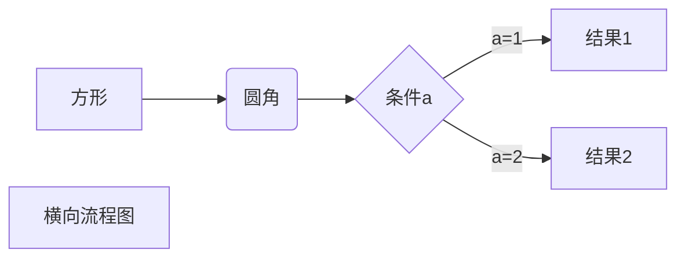
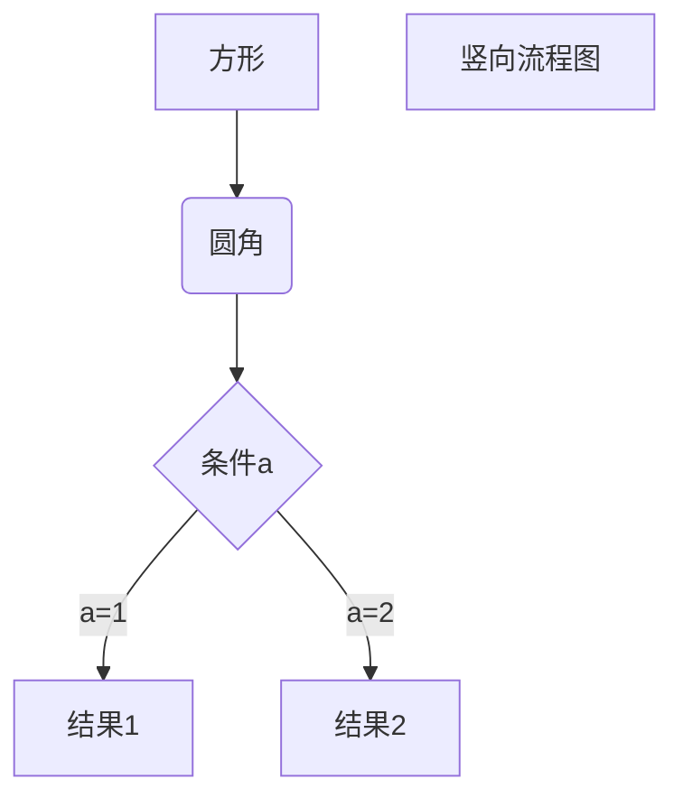
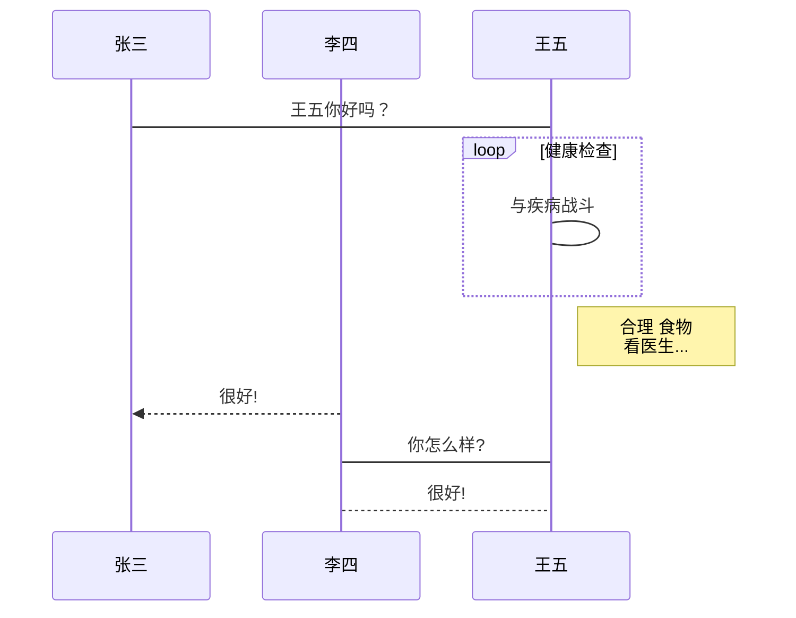
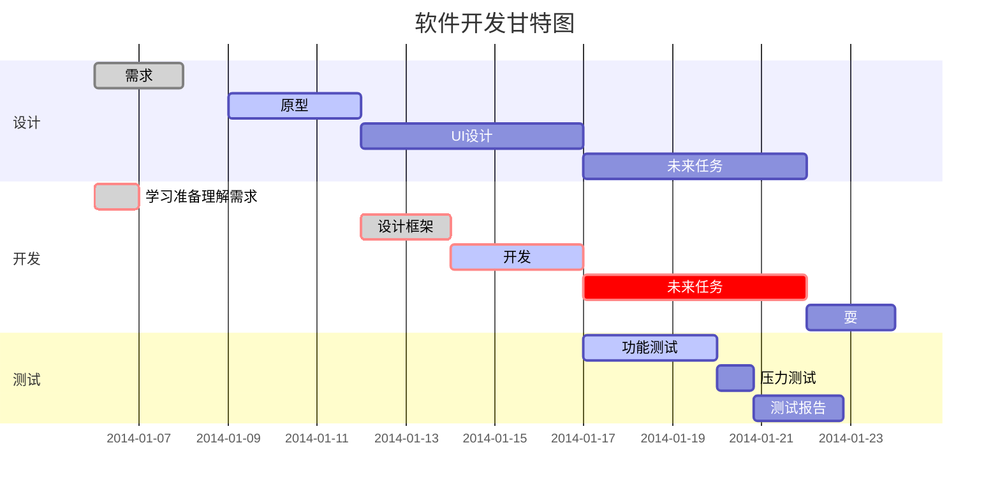

# 关于Typora

小东西的确挺别致的。

## 设置img相关操作

当Markdown插入图片时，可以选择自动copy到自定义文件夹或进行其他操作


# 绘图

以下几个实例效果图如下（可切换到源码模式查看代码）：

> 突然想起来，放到网上的是html文件，没法下载源文件然后到typora下看源码。
>
> 不过其实还是可以下载到源文件的，我的个人博客很粗糙，转换为html后，markdown文件没删。
>
> 把当前路径的后缀.html换成.md，再用wget url就能获取这篇文章的源码啦。
>
> 或者直接在浏览器地址栏改成.md，毕竟md文件浏览器一般默认下载，而不会像json之类的文件默认打开。

## Mermaid概述

使用JS开发的绘图工具

**Mermaid was nominated and won the [JS Open Source Awards (2019)](https://osawards.com/javascript/#nominees) in the category “The most exciting use of technology”**

### 布局关键字

T：Top，B：Bottom，L：Left，R：Right

graph TB/BT/LR/RL

### 节点形状

[]、{}、()

### 连接线形状和描述

### 组合形式


## Mermaid实例

**1、横向流程图源码格式：**



**2、竖向流程图源码格式：**



**3、标准流程图源码格式：**

```flow
st=>start: 开始框
op=>operation: 处理框
cond=>condition: 判断框(是或否?)
sub1=>subroutine: 子流程
io=>inputoutput: 输入输出框
e=>end: 结束框
st->op->cond
cond(yes)->io->e
cond(no)->sub1(right)->op
```

**4、标准流程图源码格式（横向）：**

```flow
st=>start: 开始框
op=>operation: 处理框
cond=>condition: 判断框(是或否?)
sub1=>subroutine: 子流程
io=>inputoutput: 输入输出框
e=>end: 结束框
st(right)->op(right)->cond
cond(yes)->io(bottom)->e
cond(no)->sub1(right)->op
```

**5、UML时序图源码样例：**

```sequence
对象A->对象B: 对象B你好吗?（请求）
Note right of 对象B: 对象B的描述
Note left of 对象A: 对象A的描述(提示)
对象B-->对象A: 我很好(响应)
对象A->对象B: 你真的好吗？
```

**6、UML时序图源码复杂样例：**

```sequence
Title: 标题：复杂使用
对象A->对象B: 对象B你好吗?（请求）
Note right of 对象B: 对象B的描述
Note left of 对象A: 对象A的描述(提示)
对象B-->对象A: 我很好(响应)
对象B->小三: 你好吗
小三-->>对象A: 对象B找我了
对象A->对象B: 你真的好吗？
Note over 小三,对象B: 我们是朋友
participant C
Note right of C: 没人陪我玩
```

**7、UML标准时序图样例：**



**8、甘特图样例：**



## 其他

### Code模式的Flow语法

Code模式本意是为Code而生，可以选择注明语言，如Python、Java等，通过插件实现更好的排版和语法高亮等。

注明语言为Flow时可以像写代码一样写流程图

