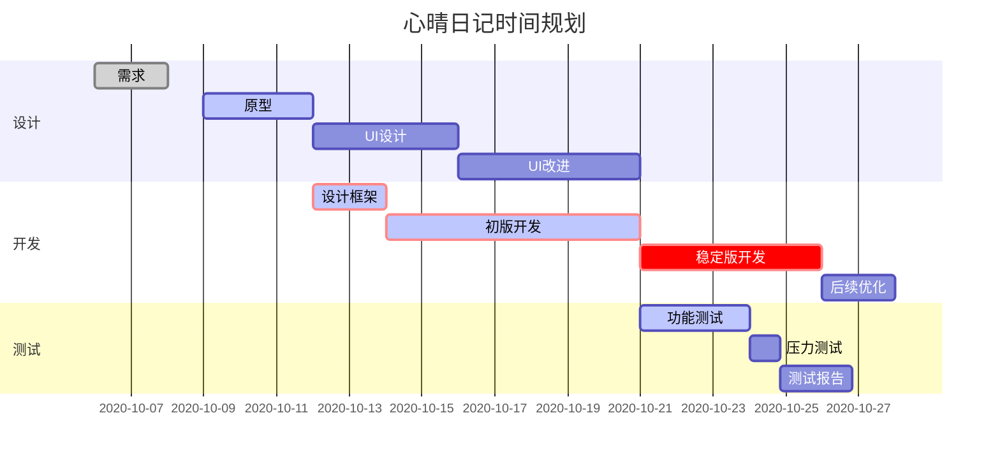

# 团队介绍

吴泽华，团队颜值担当一号

万龙广，团队颜值担当二号

肖林剑，团队颜值担当三号

李彰恒，团队颜值担当四号

徐豪杰，团队颜值担当五号

团队啥也没有，就剩颜值了。

# 产品定位

* 记录功能

一款小巧的、跨平台、支持云同步的编辑器。

* 社交属性

能够分享自己的心情、笔记、灵感到app建立的论坛或社区，也能在社区看到其他人的分享。

该功能可以选择开启和关闭。因人而异。

## 目标市场

不以大量盈利为目的，一款小巧轻便的日记、笔记、随笔编辑器。

可开发部分高级功能，付费开启（订阅或买断制均可）。

## 竞品分析

### EverNote/印象笔记

#### 优点

* 支持多平台、云端同步
* 富文本、所见即所得

#### 缺点

* 过度强调富文本而导致臃肿
* 不支持移动端新建markdown笔记
* 社区分享功能体验很差

### Typora

#### 优点

* 强大的Markdown编辑能力，所见即所得，谁用谁说好
* 大纲、导入导出、代码高亮、自定义主题等应有尽有
* 基于Markdown带来的更清晰的逻辑

#### 缺点

* Markdown专属编辑器
* 无移动端应用，无云端同步
* 基于Electron开发，需NodeJS支持

### 各平台自带记事本

#### 优点

* 简洁，可随手记录
* 通用性强

#### 缺点

* 不同平台之间不互通，除非apple/华为/小米/MS全家桶
* 富文本能力不强，排版较难

## 目标用户群体

* 所有希望能够随手记下生活点滴心情、生活、灵感的人。
* 所有希望能够随时随地开始自己创作的人。
* 所有希望有一个更自由、更方便的编辑器的人。
* 所有希望一个陌生但友好的交流、分享环境的人。（社交属性部分）

## 类型用户场景

* 随手记录心情或灵感

项目开发的初心，希望应用能够帮助每一个人随时记录下自己的所见、所得。

例如当遇到一家很好喝的奶茶店时的欣喜心情，当遇到突如其来的暴雨是的郁闷，都可以分享。当然也不止心情。

* 逻辑性很强的全面创作
  * 基于之前的灵感或心情，进行完整的整理和创作。
  * 随时随地对自己知识体系进行梳理，进行专业性较强、整洁性要求较高的创造。
  * 作为辅助，在不同平台之间进行创作同步，让人无论身处何地，有手机、平板、电脑其一，即可进行完整创作。

* 分享、交流
  * 将自己随手记录的心情、灵感分享到社区/论坛，与也许不太熟悉的人分享。
  * 将自己对某些事情的专业性认识整理成文章发布到社区，与志同道合的人交流。
  * 在社区看其他的心情、灵感，或是其他人与自己专业相关的见解、认知、分享。

# 用户和调研访谈

# 主要功能分析

* 随手记录心情或灵感

项目开发的初心，希望应用能够帮助每一个人随时记录下自己的所见、所得。

* 逻辑性很强的全面创作

可以是基于之前的灵感或心情，进行完整的整理和创作。

可以是随时随地对自己知识体系进行梳理，进行专业性较强、整洁性要求较高的创造。

也可以作为辅助，在不同平台之间进行创作，让人无论身处何地，有手机、平板、电脑其一，即可进行完整创作。

* 分享、交流

可以将自己随手记录的心情、灵感分享到社区/论坛，与也许不太熟悉的人分享。

可以将自己对某些事情的专业性认识整理成文章发布到社区，与志同道合的人交流。

更可以在社区看其他的心情、灵感，或是其他人与自己专业相关的见解、认知、分享。

# 风险考虑

低成本，相应的低风险。

（虽然也低收益，但人咋能向钱看呢，对吧！）

最差的情况，面对现有的商业化软件毫无竞争力，团队就地解散，考虑到只会是一个很小的团队，故后果不大。

# 时间规划

