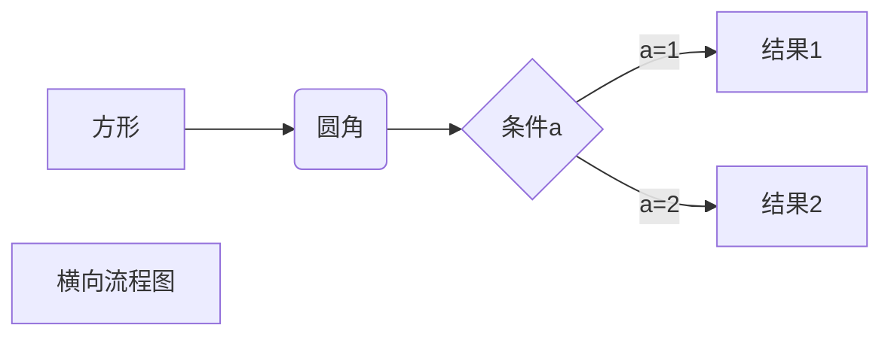
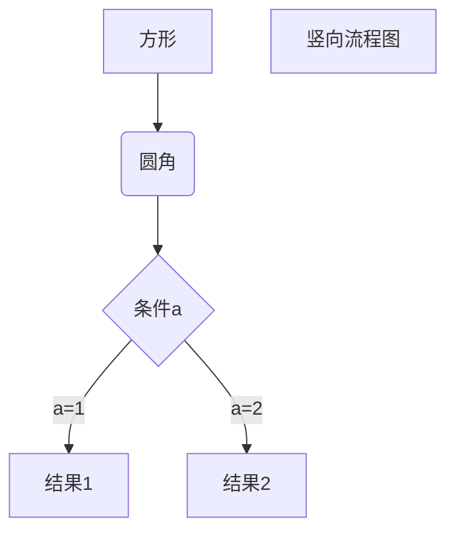
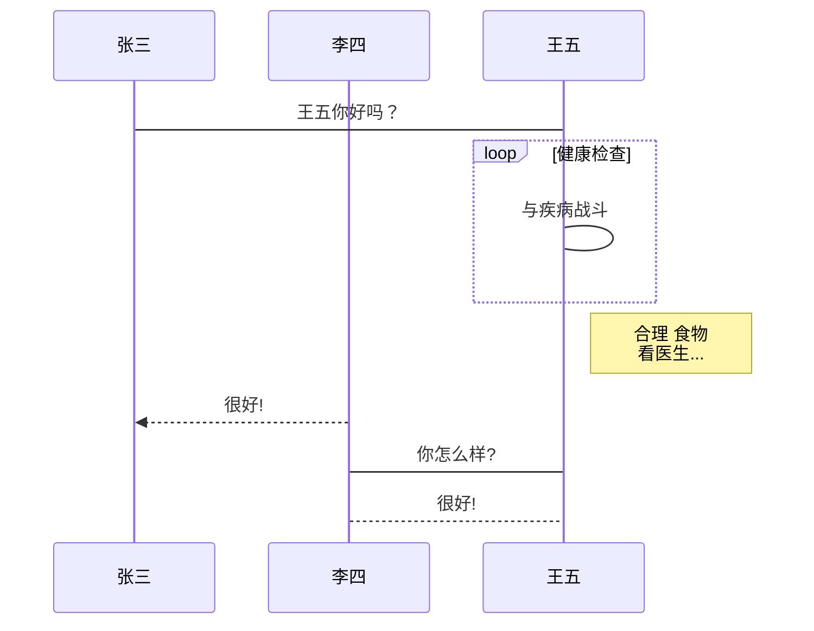
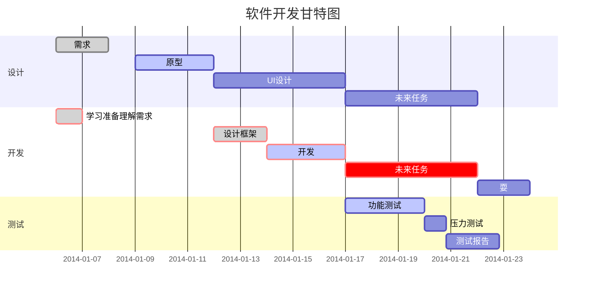

# About Markdown

In 2002 Aaron Swartz created atx, "the true structured text format". 

Swartz and John Gruber then worked together to create the Markdown language in 2004, with the goal of enabling people "to write using an easy-to-read and easy-to-write plain text format, optionally convert it to structurally valid XHTML (or HTML)".

> 关于Markdown的历史环境和时代性，可以参考下面的回答，个人观点与之类似：
>
> 为什么Markdown在2004年才出现，而推广更晚？ - 马宏菩的回答 - 知乎 https://www.zhihu.com/question/54719422/answer/142585646
>
> 简言之，老大哥HTML为了适应时代，妥协了，变了，变得强大花哨，但有得必有失，HTML不再适合直接写作，需要有个小弟来填补这个空白。
>
> Markdown自己就是其中很优秀的小弟，又有Github等好爹（这种行为参考余姚叫父冬瓜强），最终脱颖而出，风头一时无两。

Gruber wrote a Perl script, Markdown.pl, which converts marked-up text input to valid, well-formed XHTML or HTML and replaces angle brackets `<` `>` and ampersands `&` with their corresponding character entity references. 

It can take the role of a standalone script, a plugin for Blosxom or a Movable Type, or of a text filter for BBEdit.


## John Gruber[^1]-原生标准

作为Markdown的创始人之一，对Markdown的影响力和权威性毋庸置疑。

Markdown借鉴了许多在它之前的markup语言，如[Setext](http://docutils.sourceforge.net/mirror/setext.html), [atx](http://www.aaronsw.com/2002/atx/), [Textile](http://textism.com/tools/textile/), [reStructuredText](http://docutils.sourceforge.net/rst.html), [Grutatext](http://www.triptico.com/software/grutatxt.html), and [EtText](http://ettext.taint.org/doc/)


> black line: a line containing nothing but spaces or tabs is considered blank.

John Gruber将Markdown基础标记像HTML那样标为`block elements`和`span elements`两类。

`block elements`主要有：

* 标题
  * 支持Setext和atx两种风格的标题
  * atx风格用`##`，几级标题用几个`#`
    * 可以在标题后继续追加任意个`#`，作为美化
  * 还可以用Setext风格的标题
    * `Header info`然后换行，`========`表示一级标题，`-------`表示二级标题
* 引用
  * Markdown用`>`表示引用
  * 可以只在每一段话之前加一个`>`，也可以每一行（一段话可能有多行）前都加`>`。
  * 引用可以嵌套，也可以包含其他Markdown元素
* 列表
  * 用`*`、`-`、`+`都可以标记无序列表（对应html`ol`标签）
  * 用形如`1.`标记有序列表（对应html`ul`标签），但“有序”列表完全可以是乱序的，即不一定按自然数序
  * 列表的每一项也可以有多段内容，换行后，用四个空格或制表符标记
* 代码块
  * 用四个空格或一个制表符标记，但……这种用法基本被抛弃了
  * GFM（Gihub Flavored Markdown）标准更香，用前后各三个反引号标记
* 水平线
  * 就`---------------------`或者`*******************`之类，随你开心


`span elements`主要有

* 超链接
* 加粗、斜体
* 代码
* 图片

不赘述了。


### inline HTML

> John Gruber: Markdown’s syntax is intended for one purpose: to be used as a format for *writing* for the web.

Markdown不是HTML的竞品，所以它的原则应该尽可能的简单，尽可能地Focus on Plain Text.

所以当需要更多内容地时候，直接交给HTML语法就行。

* Block-level HTML element需要用空行（而不仅是用空格或制表符）隔开。
* Span-Level HTML tags可以随意插入

> 如果你喜欢，甚至可以在一份Markdown文件中不用任何Markdown语法，纯用HTML。
>
> 此时的Markdown文件也不需要转换，把后缀名改成html就能在浏览器打开（虽然缺少HTML、head、body之类的标签，但相信你的浏览器够聪明）。

John Gruber的规范里，&是个转义符，用于标记HTML entities，如`&amp`、`&lt`。

> Typora好像没有采用这一点规则，可以无障碍输入&符号。

John Gruber自己给出的实现（用Perl）：https://daringfireball.net/projects/downloads/Markdown_1.0.1.zip

## Github Flavored Markdown[^2]-主流标准

作为Markdown的好爹，Github也提出了一套关于Markdown的基础标准。

> 在Typora-Preference-Markdown里有strict mode选项，You could enable **strict mode** to tell Typora to follow [GFM’s spec](https://github.github.com/gfm/) more strictly. 
>
> 看来Typora也是灰常青睐GFM。

* 标准MD要在一行的最后加两个空格符才表示换行，否则是不换行的。但是GFM则没有此要求。
* 标准的MD用两边加下划线表示斜体，但对于码农社区Github而言这条规则很不方便，比如很多变量命名会用下划线（虽然Markdown有代码模式，代码模式内的下划线不会被转义）
* 在GFM中，一个有效的URL会自带超链接效果。
  * 当然标准的MD方式（指定对URL的文字描述）依旧支持且普遍使用。
* 使用前后各三个反引号标记代码段，还可以在三个反引号后指定语言，方便高亮
  * 使用单个反引号框起行内代码
  * 标准的MD使用4个空格对齐，比较麻烦，扩展性略差
* 支持带勾选框的任务列表


更多内容有空再填坑，也可以自行参考https://docs.github.com/en/github/writing-on-github

## 更多衍生


# 绘图

以下几个实例效果图如下（可切换到源码模式查看代码）：

> 突然想起来，放到网上的是html文件，没法下载源文件然后到typora下看源码。
>
> 不过其实还是可以下载到源文件的，我的个人博客很粗糙，转换为html后，markdown文件没删。
>
> 把当前路径的后缀.html换成.md，再用wget url就能获取这篇文章的源码啦。
>
> 或者直接在浏览器地址栏改成.md，毕竟md文件浏览器一般默认下载，而不会像json之类的文件默认打开。

## Flow和Sequence


Code模式本意是为Code而生，可以选择注明语言，如Python、Java等，通过插件实现更好的排版和语法高亮等。

注明语言为Flow时可以像写代码一样写流程图，注明语言为Sequence时可以写UML时序图。


**标准流程图源码格式：**

```flow
st=>start: 开始框
op=>operation: 处理框
cond=>condition: 判断框(是或否?)
sub1=>subroutine: 子流程
io=>inputoutput: 输入输出框
e=>end: 结束框
st->op->cond
cond(yes)->io->e
cond(no)->sub1(right)->op
```

**标准流程图源码格式（横向）：**

```flow
st=>start: 开始框
op=>operation: 处理框
cond=>condition: 判断框(是或否?)
sub1=>subroutine: 子流程
io=>inputoutput: 输入输出框
e=>end: 结束框
st(right)->op(right)->cond
cond(yes)->io(bottom)->e
cond(no)->sub1(right)->op
```

**UML时序图源码样例：**

```sequence
对象A->对象B: 对象B你好吗?（请求）
Note right of 对象B: 对象B的描述
Note left of 对象A: 对象A的描述(提示)
对象B-->对象A: 我很好(响应)
对象A->对象B: 你真的好吗？
```

**UML时序图源码复杂样例：**

```sequence
Title: 标题：复杂使用
对象A->对象B: 对象B你好吗?（请求）
Note right of 对象B: 对象B的描述
Note left of 对象A: 对象A的描述(提示)
对象B-->对象A: 我很好(响应)
对象B->小三: 你好吗
小三-->>对象A: 对象B找我了
对象A->对象B: 你真的好吗？
Note over 小三,对象B: 我们是朋友
participant C
Note right of C: 没人陪我玩
```


## Mermaid概述

使用JS开发的绘图工具

**Mermaid was nominated and won the [JS Open Source Awards (2019)](https://osawards.com/javascript/#nominees) in the category “The most exciting use of technology”**

### 布局关键字

T：Top，B：Bottom，L：Left，R：Right

graph TB/BT/LR/RL

### 节点形状

[]、{}、()

### 连接线形状和描述

### 组合形式


## Mermaid实例

**横向流程图源码格式：**



**竖向流程图源码格式：**



**UML标准时序图样例：**



**甘特图样例：**




# YAML Front Matter

## YAML

> 又是递归缩写，Yaml Ain't Markup Language

一个可读性高，并容易被人类阅读，容易和脚本语言交互，用来表达资料序列的标称语言。

> 第一次看到YAML是一个数据竞赛，后来又见到Kafka也用YAML做配置文件，Kubernetes也有Yaml，但个人总感觉YAML没Json香啊（至少在成熟的IDE里json使用体验是针不戳）。

### 语法规则

* 大小写敏感
* 使用缩进表示层级关系
  * 缩进时不允许使用Tab键，只允许使用空格。
  * 缩进的空格数目不重要，只要相同层级的元素左侧对齐即可
* 支持的数据结构：字典、数组、纯量
  * 用冒号区分标识键值对，如key: value
  * 一个数组的数组名和数组内容之间的关系也可以理解为一个键值对
* **value和’:’之间要有空格，很重要，故加粗**

### 字典

方法一：

```yaml
key: {key1: value1, key2: value2, ...}
```

方法二：

```yaml
key:
    child-key: value
    child-key2: value2
```

方法三：更复杂的键值对，问号加一个空格代表一个复杂的 key，一个冒号加一个空格代表一个 value：

```yaml
?  
    - complexkeyPart1
    - complexkeyPart2
:
    - complexvaluePart1
    - complexvaluePart2
```

三种方法是等价的，法二和法三是为了更好的视觉效果而做出的改进

如下图所示yaml内容，是用法一写的

```yaml
house:
  family:
    name: Doe
    parents: [John, Jane]
    children: [Paul, Mark, Simone]
  address: { number: 34, street: MainStreet, city: Nowheretown, zipcode: 12345 }
```

经python代码读取再写出（中途不作改变）：

```python
import yaml

with open('test.yaml','r') as reader:
    data = yaml.load(reader)

with open('write_in.yaml','w+') as writer:
    writer.write(yaml.dump(data))
```

就会以方法二的形式导出结果：

```yaml
house:
  address:
    city: Nowheretown
    number: 34
    street: MainStreet
    zipcode: 12345
  family:
    children:
    - Paul
    - Mark
    - Simone
    name: Doe
    parents:
    - John
    - Jane
```


### 跟md不太相关的

Python解析YAML

```python
import yaml
# 载入
with open('test_yml.yml','r') as reader:
    data = yaml.load(reader)
# 导出
with open('test_yml.yml','w') as fb: #或者 f=oepn("filename",'w')
    fb.write(yaml.dump(data))

```


## Front Matter

Front-matter 是文件最上方以 — 分隔（三个连续短横）的区域，用于指定个别文件的变量。

```yaml
---
title: Hello World
date: 2013/7/13 20:46:25
---
```


# 其他技巧

## md引入参考文献

通过后跟如下标识在文中引入参考文献，其中1为编号

```text
[^1]
```

在文末用如下标记注明对应的参考文献

```
[^1]:
```

在typora中的效果图


## Typora Themes


[^1]:https://daringfireball.net/projects/markdown/syntax
[^2]:https://docs.github.com/en/github/writing-on-github