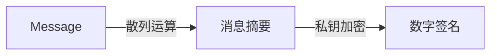
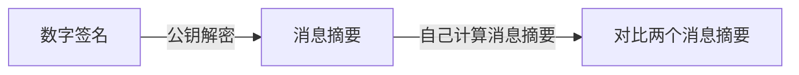

对通信“安全”的需求可以有多个方面

* 信息不被泄露
* 信息不被篡改


# 非对称加密算法

传统密码的密钥是对称的，通常只要知道加密密钥就能反向推算出解密密钥。于是带来了很多不足。

* 不仅解密密钥不能泄露，加密密钥也一样不能泄露，仅限于通信双方得知
* 需要另有一条特殊的信道用于交换密钥（这一条其实还是为了保证上一条）
* 显然，这样的密钥不可能多方共用，其中任意一方都可以泄密


其核心，或者说神奇之处，在于明明通过两个密钥完成了一个互逆的计算过程，解密密钥却无法通过加密密钥获取，或者说能从数学层面能够证明通过加密密钥获取解密密钥是极难的，因而可以索性将加密密钥公开，称为公钥。

> 当然并不是真的无法破解。
>
> 以RSA算法为例，如果质数$p,q$取得不太大，并愿意动用目前全球所有算力，大概还是有希望在有生之年看到结果的。


Diffie-Hellman密钥交换算法的出现，作为一种崭新构思，可以在不直接传递密钥的情况下，完成解密。

## Diffie-Hellman密钥交换算法

### 离散对数

1. 原根：对于数$a$和数$p$，若有$a,a^2,a^3,...,a^{p-1}$对于$p$取余都有不同的值（即对应从1到p-1的一种排列），则称$a$是素数$p$的原根。
2. 离散对数：对于数$b$和数$i$，若有$b=a^i\%p$，则称$i$为$b$的（以$a$为基数模$p$的）离散对数。

已知$i$，计算$b$是很简单的；而反过来，已知$b$，计算$i$却是很困难的。

>  即对满足同一个式子的两个量，正向和反向的两个计算过程对于计算机而言计算量却不是一个量级的

Diffie-Hellman密钥交换算法有效性依赖于计算离散对数的难度。

### 算法原理

1. 公开信息：选定素数和原根$p,a,(a<p)$
2. A、B各自选定任意两个数$X_a,X_b$
3. 计算$Y_a,Y_b$：$Y_a=a^{X_a}\%p,Y_b=a^{X_b}\%p$，并公开$Y_a,Y_b$
4. A通过计算$K = Y_b^{X_a} \% p$得到密钥，同理B通过计算$K = Y_a^{X_b} \% p$得到密钥

又已知，通过$Y_a,Y_b$反向得到离散对数$X_a,X_b$是困难的。所以外人因为没有$X_a,X_b$之一，无法得到密钥，

> 简单证明A、B两人计算得到的密钥相同：
>
> $K_a = Y_b^{X_a} = (a^{X_b})^{X_a} = a^{X_a * X_b} = Y_a^{X_b} =K_b(\mod p )$


## RSA先验内容

### 欧拉函数和欧拉定理

$\phi(x)$为欧拉函数，即比x小但与x互素的数的个数

若a与n互素，则有
$$
a^{\phi(n)}\equiv 1 (\mod n)
$$


特别地，当n为素数时，$\phi(n) = n-1$，从而可以得到费马小定理。


### 费马小定理

设p是素数，且a与p互素，则有
$$
a^{p-1} \equiv 1 (\mod p)
$$
或者也写成
$$
a^p \equiv a(\mod p)
$$
费马小定理提供了一种不用因子分解就能肯定一个数是合数的新途径。


## RSA算法和证明

> Diffie-Hellman密钥交换算法依赖于离散对数的计算困难性，而RSA依赖于大数因子分解的困难性。

取两个大素数$p,q$，有$n=pq,\phi(n)= pq(1-\frac 1 p)(1- \frac 1 q) =(p-1)(q-1)$

取正整数$w$，与$\phi(n)$互素，$d$为$w$的模$\phi(n)$的逆（即$dw=1(\mod \phi(n))$）。

1. 将明文分段并数字化，且每个明文段值$m$小于$n$
2. 加密：$c= E(m) = m^w \mod n$
3. 解密：$m = D(c) = c^d \mod n$

其中$w,n$是公开的，$p,q,\phi(n),d$保密。


> 显然，$d,w$是对称的，互逆的，在$(n,w),(n,d)$中任选一个选为公钥，另一个则为私钥。
>
> 显然在没有$\phi(n)$的情况下，无法通过公钥$w$推出私钥$d$，而分解$n$又是在实际中不太可能的。
>
> 脱离开数学范围，到具体的应用中，常用符号$r=\phi(n),e=w$


要证明$m=c^d \mod n$，即证明$c^d \equiv m(\mod n)$，亦即证明$m^{wd} \equiv m(\mod n) $

若$m,n$互素，因为存在$k$使得$dw = k\phi(n)+1 $，所以由欧拉定理可直接证明$m^{wd} \equiv m^{k\phi(n)+1} \equiv m (\mod n)$

若$m,n$不互素，$m$必包含$p,q$其中一个为因子。不妨设$m=cp$ 且$q \nmid m$，

由费马小定理，有$m^{k\phi(n)} \equiv m^{k(p-1)(q-1)} \equiv 1^{k(p-1)} \equiv 1(\mod q)$

即存在$h$使得$m^{k\phi(n)} =hq+1 \Rightarrow m^{k \phi(n) +1}=hcn + m \Rightarrow m^{dw} \equiv m(\mod n)$，证毕。


# 数字签名和CA证书授权

## 数字签名[^2]

数字签名基于哈希和非对称加密算法，能有效防止消息被篡改或传输出错。

> 在下载软件包的时候常常会看到在一个软件包下还有一个SHA256的验证码，通过对比SHA256，可以验证内容是否被更改或传输是否正常。

### 哈希和消息摘要

哈希aka散列，SHA家族是常用的散列函数。


### 签名

A用私钥进行数字签名：



因为只有A拥有私钥，所以可以认为从摘要到数字签名的过程是无法伪造的。

B用公钥和数字签名判断内容是否被更改/传输有误。




## 证书授权

有了RSA算法，”中间人“攻击还是没有完全避免。

攻击者可以在收到A的公钥的同时，向B发送自己的密钥对的公钥（自己同时保留相应的私钥）。

这样一来，攻击者既能跟A顺畅通信，得到所有内容，也能更改内容，用自己的密钥对伪造签名，并跟B保持通信。

B该如何验证A的公钥是否合法呢？

### CA-Certificate Authority

引入第三方权威机构。

最顶级的CA是内嵌在浏览器中的。他们是信任的终点/根，就像是经济活动中的国家一样，是信任的终点

> CA在互联网环境中的信用地位好比国家在经济活动中的信用地位。
>
> （遥远的高中政治课）纸币不等于货币，纸币不是一般等价物，离开了国家的信用背书，那么纸币一文不值；但有国家信用在，国家承诺了纸币和一般等价物（黄金）之间的转换，就可以像一般等价物一样作为货币流通了。
>
> 而其他的，不管是银行还是支付宝微信，都是在国家信用的基础（中心）上，进一步让用户直接信任自己，就像获得CA证书的服务商一样。
>
> 咳咳，扯远了。

有一个概念叫”公钥基础设施“，而CA就是公钥基础设施的核心，从名字就可以看出CA对互联网公钥的管理地位。


> WebTrust是由全球两大著名注册会计师协会AICPA（美国注册会计师协会）和CICA（加拿大注册会计师协会）共同制定的安全审计标准，主要对互联网服务商的系统及业务运作逻辑安全性、保密性等共计七项内容进行近乎严苛的审查和鉴证。

WebTrust认证是各大主流的浏览器、微软等大厂商支持的标准，是规范 CA 机构运营服务的国际标准。在浏览器厂商根证书植入项目中，只有通过 WebTrust 国际安全审计认证，根证书才能预装到主流的浏览器而成为一个全球可信的CA认证机构，从而实现浏览器与数字证书的无缝嵌入。

国际顶级的CA机构有GeoTrust、Sectigo、Digicert、GlobalSign、Entrust等。

> 中国金融认证中心（China Financial Certification Authority，简称CFCA）是经国际权威的WebTrust认证以及中国人民银行和国家信息安全管理机构批准成立的国家级CA，也是国内一流水平的电子认证服务机构和信息安全综合解决方案提供商。旗下自主研发纯国产SSL证书，包括OV, EV SSL证书，不仅可支持国密算法（SM2/SM3），满足政府/金融等组织、机构国家监管需求，也得到全球各大浏览器，操作系统及设备的认可。


>个人对区块链并没有那么感兴趣，感觉噱头的成分太大，但不得不说，如果成功，当今所有的信用体系，从国家到CA，都会受到很大的影响。
>
>咳咳，又扯远到自己不擅长的领域了。


### CA证书示例

下图为cn.bing.com的CA证书。


下图中可以看到，其由Microsoft IT TLS CA 2签发，而没有挂钩其他知名CA机构中

（毕竟是互联网巨头，何必寄人篱下，Google用的也是GTS(Google Trust Services)）

bilibili、百度、阿里的证书好像都是GlobalSign，知乎是GeoTrust。


下图中可以看到更具体地信息，包括公钥等。


# 梳理

## 需求：信息不被泄露

在最开始用对称加密：

```sequence
A --> B: “特殊信道”传递对称密钥
Note left of A: 用对称密钥加密E=encode(M)
A -> B: 传递加密信息E
Note right of B: 用对称密钥解密M=decode(E)
```

在这种过程中，密钥的传递是很困难的，需要特殊的信道或提前约定。

在互联网环境下，这两种方法都不太可能实现。

* 大家都是通过TCP/UDP传输，没有特殊的信道。
* 随时都有新的客户端或服务端动态加入、退出互联网，不可能一一提前约定。
  * 如果统一告知密钥，那显然加密和没加密也一样了。

于是需要非对称加密登场，索性公布公钥，自己保留私钥

```sequence
A->B: 告知公钥
Note left of A: 用私钥加密，E=Encode(M1)
A->B: 发送加密信息E
Note right of B: 用公钥解密，M1=Decode(E)
Note right of B: 用公钥加密信息M2并返回
B->A: 发送加密信息D
note left of A: 用私钥解密得到信息M2
note left of A: 完成通信
```

即使加密的信息被截获了，没有公钥无法得到任何有用信息。

即使公钥泄露了，还是无法获得公钥加密后的信息（公钥无法解密公钥加密的信息），只有A保有私钥。

但这还是不够，如果黑客在监听了整个Session，然后再伪造另一对公钥、私钥，将伪造的公钥给B，黑客还是有机会充当“中间人”的角色：

```sequence
note left of A:生成一号密钥对
A->Hacker:告知公钥1
note right of Hacker: 保存A的公钥
note right of Hacker: 生成二号密钥对，保留私钥
Hacker->B:告知公钥2
note left of A:用私钥加密信息M
A->Hacker: 发送加密信息E
note right of Hacker: 用公钥1解密得到信息
note right of Hacker: 用私钥2加密信息
Hacker->B: 发送用私钥2加密的信息
note right of B: 用Hacker给的公钥解密
B->Hacker:返回公钥2加密的信息
note right of Hacker: 解密信息
note right of Hacker: 用A的公钥重新加密
Hacker->A: 返回加密信息
note left of A: A的信息交流被窃听但不知情
```

B该如何确保自己收到的公钥确实是A的公钥，而不是“中间人”的呢？

虽然很不情愿，但最终还是得引入第三方权威中介机构——CA，Certificate Authority.


```sequence
note right of Server: File包括公钥、签发者(CA)、有效期等信息
note left of Server: Digest = Hash(File)
note left of Server: Signature=私钥加密(Digest)
note left of Server: 数字证书 = File + Signature
Server->CA: 上传数字证书
note right of Client:
Client-->Server:HTTPS请求
Server->Client: 发送数字证书
note right of Client: 从File部分得到公钥
note right of Client: Digest1 = Hash(File)
note right of Client: Digest2 = 公钥解密(Signature)
note right of Client: 验证 Digest1 = Digest2
Client ->CA:
```


## 需求：信息不被篡改

但在有些时候，我们的目的是公布消息/文件，需求是消息/文件内容不被篡改。

此时只需要数字签名就可以了

```sequence
Authority->Public: Release a file or software

```


# 网络安全实例

https和ssh是github接受的两种clone方式。github某种程度上本就为开源而生（对于public的仓库），所以通过http和ssh都可以clone任意repository.

用http在push的时候是需要验证用户名和密码的。而 ssh在push的时候，是不需要输入用户名的，如果配置SSH key的时候设置了密码，则需要输入密码的，否则直接是不需要输入密码的。

网络环境是很危险的，可能有各种各样的攻击、伪造、中间人、信息被篡改等可能。那应该怎么实现网络的安全传输呢？

SSH和HTTPS是两种安全的传输协议（就目前的计算水平而言）。

在正常的认知里，对称加密算法是直观而天经地义的，怎样加的的密，就要怎样解，解铃还须系铃人。加密加了x解密就要减x，加密乘了x解密就要除以x。


## SSH

ssh是一个传输协议，一个加密的传输协议，通常基于神奇的RSA算法。

### 私钥和公钥

公钥和私钥相对的，是可以互换的。

在实际操作中，openssl生成两个密钥，你选择公开（一般都默认id_rsa.pub文件）的那个即为公钥，自留的（id_rsa）即为私钥。

如果你愿意，你也可以将id_rsa重命名为id_rsa.pub并作为公钥保存到其他地方，将id_rsa.pub重命名为is_rsa作为私钥。


> 但是如果你是用Openssl之类的就不行。因为Openssl把生成公、私钥用的东西和私钥全部存在私钥pem里了。并且openssl的公钥`e`固定为65537。[^1]


> 理论上，KeyGen得到的是(e,d,n)，(e,d)哪个作为公钥都是可以的，你公开的那个就是公钥，保留的那个就是私钥。
> 但实现中出于性能考虑，e是选好的e=65537（一开始是e=3，但是有小指数攻击的问题），这样e就只能作为公钥了。[^1]

### 生成SSH密钥对

指定用rsa算法，

```
ssh-keygen -t rsa
```

然后连续回车，不需要（通常）指定保存路径、passphrase


此时会在userhome/.ssh/目录下生成两个文件，即公钥和私钥。

### authorized_keys

保存所有公钥的地方，将之前生成的公钥追加写入该文件中。

```bash
cd .ssh/
cat id_rsa.pub >> authorized_keys
```

就可以畅通无阻的本地循环了，即

```bash
ssh localhost
```

当然，这并没有啥卵用，只能自己逗自己玩。

需要将id_rsa.pub保存到你所要登陆的服务器/github上。


## HTTPS

HTTP协议往往是明文传输，在互联网的环境下非常不安全。

特别是一些敏感信息，如账号密码等，使用HTTP传输会非常容易泄露隐私。

- 请求信息明文传输，容易被窃听截取。
- 数据的完整性未校验，容易被篡改
- 没有验证对方身份，存在冒充危险

因此需要HTTPS。


[^1]: https://segmentfault.com/q/1010000002932436
[^2]:[A Story about Encrypted communication](http://www.youdzone.com/signature.html)